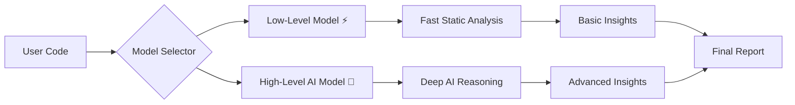

# 🧬 CO-DNA — AI-Powered Technical Debt Intelligence Platform

### 🚀 Kill Technical Debt — From Inside Your Editor

[]()
[]()
[]()

---

# 🚨 The Problem

Technical debt is **invisible but expensive**.

- ⏱️ **33% developer time wasted**
- 💸 Millions lost annually
- 🧠 Complex systems = zero clarity
- 👁️ CEOs lack visibility
- 🔐 Security risks go unnoticed

> ❌ Teams cannot **measure**, **prioritize**, or **communicate** technical debt.

---

# 💡 The Solution — CO-DNA

## 🧠 AI + Static Analysis + Security Intelligence

CO-DNA is a **full-stack AI system** that:

✔ Quantifies technical debt in **real money ($)**  
✔ Detects **security vulnerabilities in real-time**  SUCH AS DOWNLOADINHG OF MALICIOUR VIRUS, OR DEPENDENCIES(NOTIFIES)
✔ Visualizes **entire system architecture**          HELP DEVLOPERS TO KNOW WT THEY ARE CODING FOR, FOR OPTIMAL CODING IN PERSONAL AND COMPANY
✔ Provides **CEO-level + Developer-level insights**  CEO WILL GET A REPORT OF HOW THEIR CODEBASE IS AND SEE HOW WELL THE COMPANY IS PERFORMING 
✔ Suggests **optimal rewrites & modern implementations**  

---


🚀 Core Features
Feature	Description
🔍 Debt Scanner	Detects complexity, duplication, anti-patterns
🔐 Security Scanner	Detects API leaks, vulnerabilities, unsafe code
🧠 AI Explainer	Explains code in plain English
⚡ Code Modernizer	Converts legacy → modern
🔄 Full Rewrite	Rewrites entire codebase optimally
🌍 Code Translator	Converts between languages
📊 Visual Diagrams	Architecture + logic flow
💰 Business Impact	Converts tech debt → cost

## 🔍 1. Technical Debt Scanner

- AST-based analysis  
- Detects:
  - Complexity
  - Duplication
  - Anti-patterns
  - Poor architecture

### 📊 Output:
- Spaghetti Score
- Complexity Metrics
- 💰 Business Cost Estimation

---

## 🔐 2. Security Intelligence Engine

> 💣 **Real-time vulnerability detection**

Detects:

- Hardcoded API keys 🔴  
- Password leaks 🔴  
- SQL Injection risks 🔴  
- `eval()` usage 🔴  
- Unsafe dependencies 🔴  

### 🧠 Bonus:
- Detects **malicious / compromised packages**
- Alerts based on **current threat intelligence**

---

## 🧠 3. AI Code Understanding

- Explains code like a **senior engineer**
- Generates:
  - Simple explanations
  - Flowcharts
  - Architecture diagrams

---

## ⚡ 4. Code Modernization Engine

- Converts legacy → modern
- Examples:
  - Callbacks → async/await
  - Old JS → ES6+
  - Bad patterns → best practices

---

## 🔁 5. Full Code Rewrite Engine

> 💣 **One-click system upgrade**

- Rewrites entire codebase optimally
- Improves:
  - Performance
  - Readability
  - Security

---

## 🌍 6. Multi-Language Translator

- Convert code across languages
- Suggests **best language for use-case**

---

## 🏢 7. Business Intelligence Layer

### For CEOs / Managers:

- 💰 Cost of technical debt
- 📉 Productivity loss
- 📊 Risk level
- 📍 Where system is failing

### For Developers:

- 🔧 Fix plan
- 🧠 Explanation
- 📈 Priority roadmap

---

# 🧠 Dual Model Architecture (KEY INNOVATION)


User (VS Code)
      ↓
Extension (Frontend + Webview UI)
      ↓
Backend API (Node.js / Express)
      ↓
AI Layer (LLMs + Custom Models)
      ↓
Analysis Engine (AST + Metrics)
```

---

# 🧩 Project Structure

```
co-dna/
│
├── co-dna/                     # VS Code Extension
│   ├── src/
│   ├── webview/               # React UI
│   └── dist/
│
├── debtsight-backend/         # Main Backend API (Node.js)
│   ├── routes/
│   ├── services/
│   └── controllers/
│
├── model-low-level/           # Fast, lightweight analysis
│   ├── static analysis
│   └── rule-based scoring
│
├── model-high-level/          # Advanced AI reasoning
│   ├── LLM prompts
│   └── deep code understanding
│
├── website-launch/            # Landing page / product site
│   ├── frontend
│   └── marketing assets
```

---
---System Architecture
flowchart TD
    A[👨‍💻 Developer / User] --> B[VS Code Extension UI]
    B --> C[Backend API Layer]
    C --> D[Analysis Engine]
    C --> E[Security Engine]
    C --> F[AI Engine]

    D --> G[Technical Debt Metrics]
    E --> H[Security Report]
    F --> I[AI Insights]

    G --> J[Final Intelligence Report]
    H --> J
    I --> J

    J --> K[📊 Visual Dashboard]

    
⚡ Dual Model Intelligence
flowchart LR
    A[📥 Input Code] --> B{Model Selector}

    B --> C[⚡ Low-Level Model]
    B --> D[🧠 High-Level Model]

    C --> E[Static Analysis]
    C --> F[Rule-Based Scoring]

    D --> G[AI Reasoning]
    D --> H[Deep Code Understanding]

    E --> I[Basic Insights]
    F --> I

    G --> J[Advanced Insights]
    H --> J

    I --> K[📊 Final Report]
    J --> K


    
🔐 Security Intelligence Engine
flowchart TD
    A[🔍 Code Scan] --> B[Pattern Detection Engine]

    B --> C{Hardcoded Secrets?}
    B --> D{Unsafe Functions?}
    B --> E{Dependency Risk?}

    C -->|Yes| F[🔴 Critical Alert]
    D -->|Yes| F
    E -->|Yes| F

    C -->|No| G[🟢 Safe]
    D -->|No| G
    E -->|No| G

    F --> H[Security Score ↓]
    G --> H

    H --> I[🔐 Final Security Report]


    
📊 Technical Debt Pipeline
flowchart TD
    A[📥 Code Input] --> B[AST Parsing]

    B --> C[Complexity Analysis]
    B --> D[Duplication Detection]
    B --> E[Code Smell Detection]

    C --> F[Complexity Score]
    D --> G[Duplication %]
    E --> H[Issues List]

    F --> I[Spaghetti Score]
    G --> I
    H --> I

    I --> J[💰 Business Cost Estimation]


    
📦 Dependency & Threat Intelligence
flowchart TD
    A[📦 Dependencies List] --> B[Version Analysis]

    B --> C{Outdated?}
    B --> D{Vulnerable?}
    B --> E{Malicious Pattern?}

    C -->|Yes| F[⚠️ Warning]
    D -->|Yes| G[🔴 Vulnerability]
    E -->|Yes| H[💣 Threat Alert]

    C -->|No| I[🟢 Safe Dependency]
    D -->|No| I
    E -->|No| I

    F --> J[Dependency Risk Score]
    G --> J
    H --> J
    I --> J

    J --> K[📊 Dependency Report]


    
🏢 Business Impact (CEO View)
flowchart LR
    A[Technical Issues] --> B[Developer Time Loss]
    B --> C[Productivity Drop]

    C --> D[Delayed Releases]
    D --> E[Revenue Impact 💸]

    A --> F[Security Risks]
    F --> G[Potential Breach 🔐]
    G --> E

    E --> H[📊 Business Impact Report]

    
👥 Who Uses CO-DNA?
flowchart TD
    A[CO-DNA System] --> B[👨‍💻 Junior Developer]
    A --> C[🧠 Senior Engineer]
    A --> D[🧑‍💼 Tech Lead]
    A --> E[💼 CEO]

    B --> F[Code Explanation + Learning]
    C --> G[Architecture + Refactor Plan]
    D --> H[System Optimization]
    E --> I[Business Insights + Cost]

    
🔁 Full Execution Flow
sequenceDiagram
    participant U as User
    participant V as VS Code Extension
    participant B as Backend API
    participant A as AI Engine
    participant S as Security Engine

    U->>V: Select Code + Analyze
    V->>B: POST /analyze-debt
    B->>S: Run security checks
    B->>A: Send for AI analysis

    S-->>B: Security Report
    A-->>B: AI Insights

    B-->>V: Final JSON Response
    V-->>U: Display UI + Diagrams

## 🧪 How to Use CO-DNA

CO-DNA is designed to work seamlessly inside your development workflow — either through the **VS Code Extension** or the **Web Interface**.

---

## 🚀 1. Using the VS Code Extension

### ▶️ Step 1: Open Your Project

* Launch VS Code / Cursor
* Open any code file (`.js`, `.ts`, `.py`, etc.)

---

### ▶️ Step 2: Open CO-DNA Panel

* Click the **CO-DNA icon** in the sidebar
  *(or use Command Palette → “Co-DNA: Analyze Technical Debt”)*

---

### ▶️ Step 3: Select Mode

Choose from the available analysis modes:

| Mode         | What it Does                                  |
| ------------ | --------------------------------------------- |
| 🔍 Scan      | Full technical debt + security analysis       |
| 🧠 Explain   | Converts code into human-readable explanation |
| ⚡ Modernize  | Refactors code into modern standards          |
| 🔄 Rewrite   | Rewrites entire code optimally                |
| 🌍 Translate | Converts code into another language           |

---

### ▶️ Step 4: Run Analysis

* Click **Analyze / Send**
* CO-DNA sends your code to the backend engine

---

### ▶️ Step 5: View Results

You’ll get:

* 📊 **Spaghetti Score (Technical Debt)**
* 🔐 **Security Score + Risk Level**
* ⚠️ **Detected Issues & Vulnerabilities**
* 🧠 **AI Explanation**
* 📉 **Business Impact (cost estimation)**
* 🔄 **Refactor Plan**
* 📊 **Mermaid Diagrams**:

  * Architecture
  * Function Flow
  * Logic Flow

---

## 🌐 2. Using the Web Interface

### ▶️ Step 1: Open Website

* Go to your deployed frontend (e.g., Netlify)

---

### ▶️ Step 2: Paste Code

* Enter your code into the editor

---

### ▶️ Step 3: Select Model

Choose:

* ⚡ **Basic Model** → Fast, rule-based analysis
* 🧠 **Advanced Model** → AI-powered deep insights

---

### ▶️ Step 4: Analyze

Click **Run Analysis**

---

### ▶️ Step 5: Explore Results

View:

* 📊 Scores (Debt + Security)
* ⚠️ Issues
* 🔐 Vulnerabilities
* 📦 Dependency Risks
* 📊 Visual Flowcharts
* 🛠 Suggested Fixes

---

## 🔐 3. Security Features (Automatic)

CO-DNA automatically scans for:

* ❌ Hardcoded API keys
* ❌ Password leaks
* ❌ Unsafe functions (e.g., `eval`)
* ❌ Vulnerable dependencies
* ❌ Malicious patterns

👉 Alerts are shown instantly with severity levels.

---

## 🔄 4. Code Rewrite Feature

* Click **Rewrite**
* CO-DNA generates:

  * Cleaner architecture
  * Better naming
  * Optimized logic

👉 Option to **replace code directly in editor**

---

## 🌍 5. Code Translation

* Select **Translate**
* Enter target language (e.g., Python, Java, HTML)

👉 CO-DNA:

* Converts logic
* Suggests best practices for that language

---

## 📦 6. Dependency Intelligence

* Detects:

  * Outdated libraries
  * Vulnerable packages
* Suggests:

  * Safer alternatives
  * Better tools for your use-case

---

## 💼 7. Business Impact View

CO-DNA converts technical issues into:

* 💰 Cost estimation
* ⏱ Time loss
* 📉 Productivity impact

👉 Useful for:

* CEOs
* Tech Leads
* Product Managers

---

## 🧠 Pro Tip

> 💡 Use **Scan + Rewrite together**

1. Scan → Identify problems
2. Rewrite → Fix everything instantly

---

## ⚡ Quick Demo Flow (For Presentation)

1. Paste messy code
2. Click **Scan**
3. Show:

   * 🔴 Scores
   * ⚠️ Issues
   * 🔐 Security
4. Click **Rewrite**
5. Show improved code
6. Show **diagram visualization**

---

🚀 CO-DNA turns code into **insight, action, and impact** — instantly.


## 💻 Local Setup & Installation (For Judges)

To run CO-DNA locally, start the Node backend and load the VS Code extension from `co-dna/`.

### 1. Start the DebtSight backend (Node)

```bash
cd debtsight-backend
npm install
# Add API keys in .env as required by your setup, then:
npm start
```

### 2. Build and run the VS Code extension

```bash
cd co-dna
npm install
npm run compile
```

Open `co-dna` in VS Code and press **F5** (Run Extension), or install the packaged `.vsix` if you build one.

### Repository layout

| Path | Purpose |
|------|---------|
| `debtsight-backend/` | REST API used by the extension |
| `co-dna/` | VS Code extension (TypeScript + React webview) |
